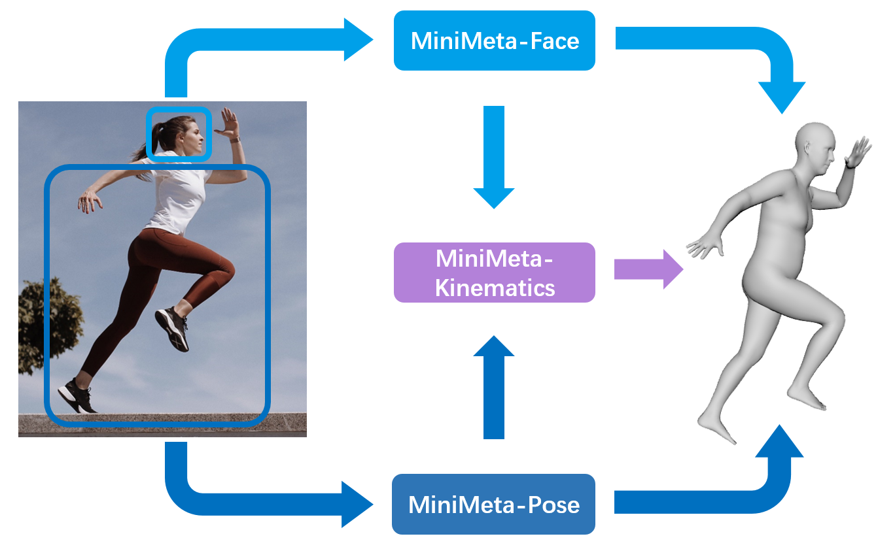

简体中文 | [English](README_EN.md)

<div align="center">
  

数字人开源项目


</div>
<div align="center">
  
</div>

## 🔥最新动态
- `2022.04.29`：首次提交。

## 📝简介
**MiniMeta** 是一个开源的数字人全流程项目，解决方案基于纯计算机视觉算法。包含了面部捕捉算法库 [MiniMeta-Face](https://github.com/minivision-ai/MiniMeta-Face) 、动作捕捉算法库 [MiniMeta-Pose](https://github.com/minivision-ai/MiniMeta-Pose) 以及人体运动学库 [MiniMeta-Kinematics](https://github.com/minivision-ai/MiniMeta-Kinematics) 。更多算法持续更新中。

|模块|涵盖算法|
|---|---|
|[MiniMeta-Face](https://github.com/minivision-ai/MiniMeta-Face) |人脸检测、关键点检测、虹膜追踪、头部姿态估计、表情系数检测|
|[MiniMeta-Pose](https://github.com/minivision-ai/MiniMeta-Pose) |2D、3D姿态估计、关节旋转估计、人体空间位置估计|
|[MiniMeta-Kinematics](https://github.com/minivision-ai/MiniMeta-Kinematics) |基于人体运动学的动作估计|

<div align="center">
  
</div>

## 🚀开始

### Clone
```
git clone --recursive https://github.com/minivision-ai/MiniMeta.git
cd MiniMeta
```

### 下载资源
[谷歌网盘](https://drive.google.com/file/d/1bJTglr6NaDlCA-YR1s1o_sCvTYJNmeqQ/view?usp=sharing) | [百度网盘](https://pan.baidu.com/s/10dpwX76bP8JC76cp-DwjKA) (提取码:shae)

1. 将解压出的 `resources` 文件夹存放在 `core/web_visualization` 路径下。
2. 参考对应的项目下载、配置 `modules` 路径下各子模块资源。

### 配置环境
项目所需的主要依赖如下：
- Python 3.7+
- [three-py](https://github.com/panxinmiao/three-py) (Python渲染引擎)
- opencv
- onnxruntime 或 onnxruntime-gpu

```
conda create -n mimimeta python=3.7
conda activate mimimeta
pip install -r requirements.txt
```

注：`requirements.txt` 中默认安装CPU版的onnxruntime，若需使用GPU加速推理，请安装onnxruntime-gpu，并配置对应的CUDA环境。

### 测试
1. 接入摄像头，开启后端程序。
```
python demo/meta_demo.py
```

2. chrome浏览器访问页面：http://127.0.0.1:5000/MiniMeta.html
<div align="center">
  
</div>

欢迎加入技术交流QQ群：227192120
